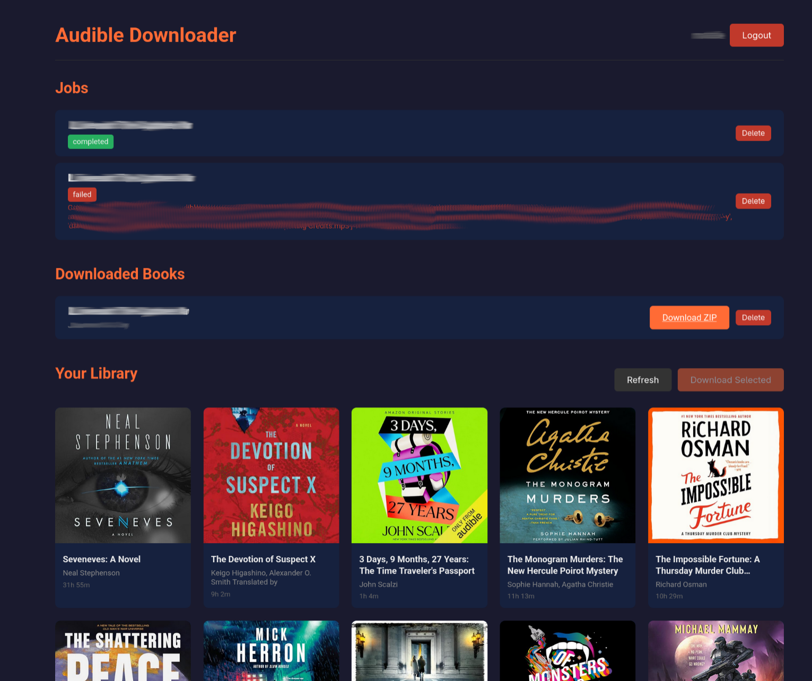

# Audible Downloader

Download Audible audiobooks as DRM-free m4b files, with MP3 on request.



## Quick Start (Web UI)

```bash
docker compose up
```

Open http://localhost:8000

1. Select your Audible marketplace and login via browser
2. Paste the callback URL to complete authentication
3. Click books to select, then "Download Selected"
4. Download the m4b when processing completes

## Output formats

**M4B** is the default and the only thing a job produces. The AAC stream Audible
delivered is copied into it without re-encoding, so it is bit-identical to the source,
carries chapter marks and cover art, and plays on Android, iOS, Kodi and VLC.

**MP3 ZIP** is a second pass, started per book with "Make MP3 ZIP", for players that
read nothing else. It splits by chapter and encodes at **twice the source bitrate**
(capped at 160 kbps for 22.05 kHz sources, 192 kbps above that). Encoding MP3 at the
source's own bitrate — which is what this used to do — leaves the added quantisation
noise only ~10 dB below the signal in the 4-10 kHz band where speech consonants sit;
doubling the rate puts it ~23 dB down, and past the cap the measurements stop improving.

The m4b is kept and the encrypted download is deleted once it exists, so MP3s can be
re-derived at any time without downloading the book again.

## CLI Mode

```bash
# Docker
docker compose run --rm cli

# Local
uv sync
uv run audible-downloader
```

## Data

- Web UI: Data stored in `./data/` (database + downloads)
- CLI: Downloads in `./downloads/`, auth in `./.audible-downloader/`
